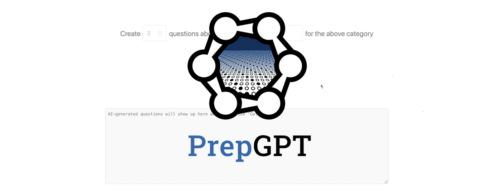

### Hi, I'm Jason 👋

## Latest Projects

### [Velovision: Your cycling superpower](https://velovision.app)
[])(https://velovision.app)

### [PrepGPT: Digital SAT exam question generation for teachers and students](https://try.prepgpt.xyz)

### [HYDO Velovision: The world's first open source cyclist overtake warning system](https://github.com/hydoai/velovision)

<!--
**neuroquantifier/neuroquantifier** is a ✨ _special_ ✨ repository because its `README.md` (this file) appears on your GitHub profile.

Here are some ideas to get you started:

- 🔭 I’m currently working on ...
- 🌱 I’m currently learning ...
- 👯 I’m looking to collaborate on ...
- 🤔 I’m looking for help with ...
- 💬 Ask me about ...
- 📫 How to reach me: ...
- 😄 Pronouns: ...
- ⚡ Fun fact: ...
-->
